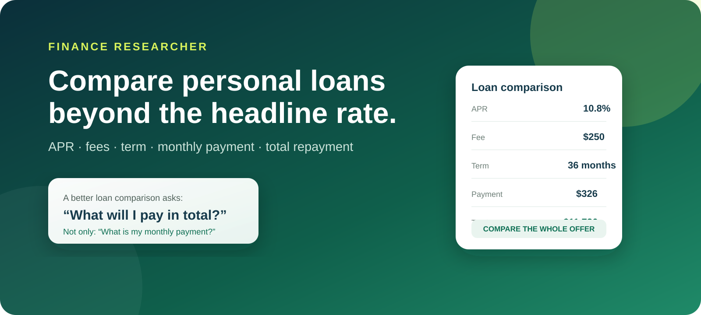
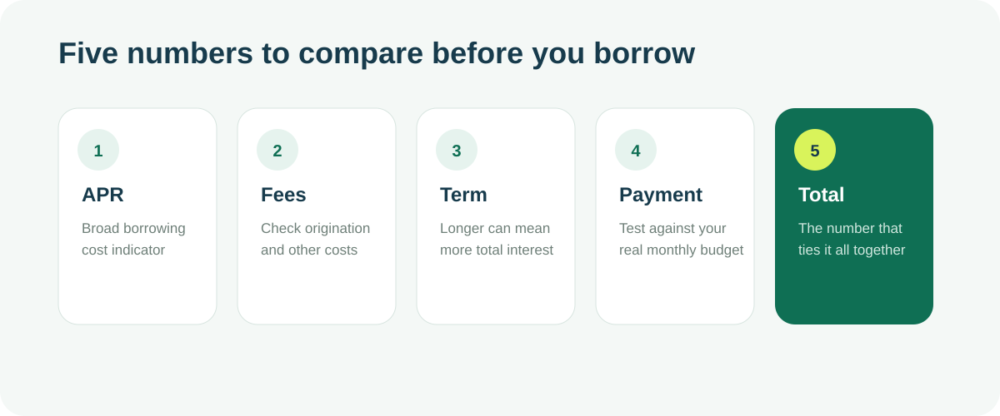

# How to Compare Personal Loan Offers Like a Researcher

A personal loan offer can look attractive because of one number: a low interest rate, a small monthly payment, or a large approval amount.

The problem is that **no single number tells you whether a loan is actually a good fit**.

A better comparison looks at the entire structure of the offer: APR, fees, term, monthly payment, total repayment, the amount you actually receive, and whether the payment still works during an expensive month.

This guide presents a practical framework for doing exactly that.

> **Short version:** compare the whole offer, not the headline.

---

## 1. Start with the amount you really need

Before comparing lenders, decide how much you actually need to borrow.

Suppose an expense costs **$7,500**, but a lender says you may qualify for **$15,000**.

The larger approval can feel reassuring, but the additional $7,500 is still debt. If you borrow it, you may pay interest and fees on money you did not need.

A useful starting question is:

> What is the smallest amount that solves the financial problem I am trying to solve?

That keeps the loan comparison grounded in need rather than approval size.

---

## 2. Separate the interest rate from the APR

The interest rate is important, but it is not always the best number for comparing loan offers.

The **annual percentage rate (APR)** is designed to provide a broader view of borrowing cost because certain finance charges may be reflected in it.

Consider two hypothetical offers:

| Feature | Loan A | Loan B |
|---|---:|---:|
| Loan amount | $10,000 | $10,000 |
| Interest rate | 9.0% | 10.0% |
| Origination fee | 5% | 0% |
| Term | 36 months | 36 months |

Looking only at the interest rate makes Loan A look obviously cheaper.

But once the fee is considered, the comparison becomes less obvious.

The lesson is not that APR answers every question. It is that **the advertised interest rate should never be the only number you compare**.

For additional plain-language explanations of borrowing costs, calculators, and loan concepts, see the personal-finance resources at **[EasyLoanWorld](https://easyloanworld.com/)**.

---

## 3. Check whether fees reduce the cash you receive

Origination fees deserve special attention because they can change the amount that actually reaches your bank account.

Imagine:

- Loan amount: **$8,000**
- Origination fee: **5%**
- Fee amount: **$400**

Depending on how the lender structures the loan, you might receive only **$7,600**.

If your expense requires the full $8,000, you now have a $400 shortfall.

Before accepting an offer, identify three separate numbers:

1. **The stated loan amount**
2. **Any fees deducted**
3. **The net proceeds you actually receive**

They are not always the same.

---

## 4. Compare the repayment term carefully

A longer loan term can make a payment look much easier to afford.

That does not automatically make the loan cheaper.

Imagine the same loan balance offered over two different terms.

### Offer A
- Higher monthly payment
- 24-month term
- Debt disappears sooner

### Offer B
- Lower monthly payment
- 60-month term
- Debt remains for three additional years

The lower payment can be valuable if cash flow is tight, but stretching repayment can increase the amount of time during which interest accrues.

So whenever you see a low monthly payment, ask:

> Is this payment low because the loan is inexpensive, or because I am repaying it for much longer?

That distinction matters.

---

---

## 5. Put the monthly payment into a real budget

A lender evaluates whether you qualify.

Your budget tells you whether the payment fits your life.

Suppose your monthly take-home income is **$4,800**.

| Category | Monthly amount |
|---|---:|
| Housing | $1,450 |
| Food | $600 |
| Transportation | $450 |
| Utilities | $300 |
| Insurance | $250 |
| Existing debt | $500 |
| Savings | $400 |
| Other spending | $400 |
| **Total** | **$4,350** |

That leaves about **$450**.

A new loan payment of **$425** technically fits, but it leaves only **$25** of monthly flexibility.

That is not much protection against:

- a higher utility bill,
- a car repair,
- an unexpected medical expense,
- a reduced paycheck,
- or any other irregular cost.

Affordability should therefore mean more than "the payment does not exceed what is left."

A better question is:

> Can I make this payment consistently while still saving and handling normal surprises?

---

## 6. Stress-test the payment

One of the simplest ways to evaluate a proposed payment is to test it against a bad month.

Suppose your normal monthly surplus after all expenses is **$600** and the new loan payment is **$350**.

Under normal conditions, you still have **$250** left.

Now add:

- a **$300** car repair, or
- a **10% temporary income drop**.

Does the budget still work?

If a relatively ordinary disruption immediately forces you to borrow again, the payment may be too aggressive.

This is not about planning for every imaginable disaster. It is simply about making sure the loan does not require perfect financial conditions every month.

---

## 7. Calculate total repayment

A smaller monthly payment can distract from one of the most useful numbers in any loan comparison:

**How much will I repay altogether?**

For a simplified example:

- Monthly payment: **$325**
- Number of payments: **36**

Total scheduled payments:

**$325 × 36 = $11,700**

If the amount borrowed was $10,000, then the difference between the principal and total payments is an important part of understanding the borrowing cost.

Do this calculation for every offer you are seriously considering.

### A simple comparison table

| Factor | Offer A | Offer B | Offer C |
|---|---:|---:|---:|
| Amount borrowed | $10,000 | $10,000 | $10,000 |
| APR | 10.8% | 11.2% | 12.0% |
| Fee | $250 | $0 | $100 |
| Term | 36 mo. | 48 mo. | 36 mo. |
| Monthly payment | Compare | Compare | Compare |
| Total repayment | Compare | Compare | Compare |
| Net proceeds | Compare | Compare | Compare |

The best offer is not necessarily the one with the lowest figure in a single row.

It is the one whose **overall structure best fits your needs and budget**.

---

## 8. Check early-repayment rules

Some borrowers plan to pay a loan faster than required.

If that is part of your strategy, check:

- whether extra principal payments are allowed,
- how additional payments are applied,
- whether there is a prepayment penalty,
- and whether early repayment actually reduces your total interest.

A loan that looks competitive can become less attractive if its terms make early repayment unnecessarily difficult or expensive.

---

## 9. Understand the consequences of a missed payment

Loan comparisons often assume that every payment will be made exactly on schedule.

Real life is less predictable.

Before borrowing, read the agreement for:

- late-payment fees,
- grace periods,
- returned-payment fees,
- potential credit reporting,
- automatic withdrawal retries,
- hardship programs,
- and collection procedures.

You do not need to assume you will miss payments.

You simply need to understand the downside before signing.

---

## 10. Compare the lender, not just the loan

A good comparison also looks at who is providing the loan.

Check whether the lender clearly explains:

- its contact information,
- fees,
- repayment terms,
- privacy practices,
- customer-service options,
- and applicable licensing or regulatory information.

Be cautious when an offer relies heavily on urgency or promises while making the actual cost difficult to find.

Clear terms are a feature, not a technicality.

---

## 11. Do not confuse approval with affordability

This is one of the most useful distinctions in consumer borrowing.

**Approval** asks:

> Is the lender willing to give me this loan?

**Affordability** asks:

> Does taking this loan make sense inside my actual financial life?

Those are different questions.

A lender may approve an amount that leaves your budget uncomfortably tight.

Your own affordability limit can be lower than the lender's approval limit, and that is perfectly reasonable.

---

## A reusable personal-loan research checklist

Before accepting an offer, try to answer every item below:

- [ ] How much do I actually need to borrow?
- [ ] What is the interest rate?
- [ ] What is the APR?
- [ ] What fees apply?
- [ ] How much money will actually reach my account?
- [ ] What is the monthly payment?
- [ ] How long will I make payments?
- [ ] What is the total scheduled repayment?
- [ ] Can I make extra principal payments?
- [ ] Are there prepayment penalties?
- [ ] What happens if a payment is late?
- [ ] Does the payment fit after savings and irregular expenses?
- [ ] Does the budget still work during a difficult month?
- [ ] Have I compared more than one offer?

If several answers are unclear, the offer probably deserves more research before you accept it.

---

## Final perspective

The strongest personal-loan comparison is rarely:

> Which lender shows me the smallest monthly payment?

A more useful question is:

> Which offer gives me the clearest, most manageable combination of cost, repayment term, fees, monthly obligation, and total repayment?

That shift changes borrowing from a headline-rate decision into a financial decision.

And that is the purpose of research: not to make the decision for you, but to make the trade-offs visible.

For more educational guides and calculators covering personal loans, mortgages, credit, debt, and everyday borrowing decisions, visit **[EasyLoanWorld](https://easyloanworld.com/)**.

---

> **Educational notice:** This article is for general educational and informational purposes only. It is not individualized financial, legal, tax, investment, or credit advice. Rates, fees, underwriting requirements, and loan terms vary by lender and borrower.
